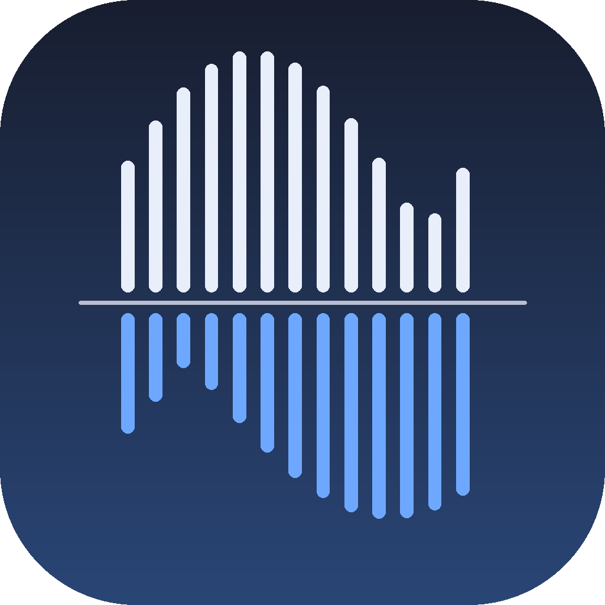

<div align="center">



# StemLab

**Stems, Tempo, Tonart, Akkorde und Lyrics – lokal auf deinem Mac.**


</div>

Lokales Studio-Werkzeug für macOS auf Apple Silicon: Song oder Video ins
Fenster ziehen und zurück kommen Stems, Tempo, Tonart, Taktraster, Akkorde,
Lyrics und ein Mixer, in dem man alles gegeneinander hört. Alles läuft auf
deinem Mac – keine Uploads, keine Warteschlange, keine Längenbegrenzung.

## Funktionen

| | |
|---|---|
| 🎛️ **Stem-Trennung** | Roformer, Demucs und MDX-Net, dazu zwei Ensembles – 2, 4 oder 6 Spuren |
| 🥁 **Taktraster** | Beats und Downbeats mit Beat This!, BPM per Regression über ein bereinigtes Raster |
| 🎹 **Tonart** | Bandbegrenztes CQT-Chromagramm mit Albrecht-Shanahan-Profilen, inklusive Camelot-Code |
| 🎨 **Camelot-Farben** | Der Key-Chip ist wie auf dem Rad eingefärbt, Moll blasser als Dur |
| 🎼 **Akkorde** | Ein Akkord pro Takt, klickbar zum Springen |
| 🔤 **Lyrics** | Whisper auf der Apple-GPU, als TXT, LRC, SRT und JSON, ohne erfundene Zeilen |
| 🎚️ **Mixer** | Alle Stems synchron, Pegel, Mute, Solo und A/B gegen das Original |
| 🏷️ **Tags & Cover** | ID3- und Vorbis-Tags samt Coverbild direkt in der Oberfläche bearbeiten |
| ✂️ **Loops** | Am Downbeat geschnitten, 2, 4 oder 8 Takte, tempo-getaggt |
| 🎧 **Pitch / Tempo** | Halbtöne und Ziel-BPM über Rubber Band |
| 🎤 **Vocals veredeln** | De-Reverb, De-Noise und Lead/Backing in einer Kette |
| 🔒 **Offline** | Kein Upload, keine Anmeldung, keine Längenbegrenzung |

## Einrichtung

**Voraussetzungen:** macOS 13 oder neuer auf Apple Silicon (M1 bis M4),
[Homebrew](https://brew.sh) und rund 3 GB Platz für Modelle.

```bash
git clone https://github.com/tmsbyr87/stemlab.git
cd stemlab
./setup.sh
```

`setup.sh` prüft Homebrew, ffmpeg und Python, legt eine isolierte Umgebung in
`venv/` an und baut `~/Applications/StemLab.app`. Starten per
Doppelklick oder mit `./start.sh`; ein zweiter Doppelklick öffnet nur ein neues
Fenster zur laufenden Instanz. Beenden über „Beenden" oben rechts.

Modelle werden beim ersten Gebrauch geladen und unter
`~/Library/Application Support/StemLab/models` behalten (Trennmodelle 65 MB bis
650 MB, Beat This! 77 MB, Whisper rund 1,5 GB). Danach läuft alles offline.

## Was beim Hineinziehen passiert

1. **Tonspur** – Audio wird als 44,1-kHz-WAV vorbereitet; bei Videos (mp4,
   mov, mkv, webm, avi, …) zieht ffmpeg die erste Tonspur heraus.
2. **Analyse** – nach wenigen Sekunden stehen in der Karte:
   - **Tempo** aus dem Taktraster von **Beat This!** (Transformer-Beat-Tracker,
     CPJKU 2024). Das Modell liefert Zeiten auf einem 20-ms-Raster, auf dem
     sich ein Tempo wie 124 BPM (0,483871 s pro Beat) gar nicht abbilden lässt;
     außerdem setzt es in dichten Passagen Zwischenschläge. StemLab bestimmt
     deshalb erst die Grundperiode, ordnet jedem Beat seine Rasterposition zu
     und regressiert nur über die Beats, die auf dem Raster liegen. Eine
     Gegenprobe über die Downbeats deckelt die Sicherheit, wenn beide
     Schätzungen auseinanderlaufen. Die Halb-/Doppeltempo-Alternative steht
     daneben, weil sie musikalisch nicht entscheidbar ist.
   - **Tonart** über ein auf **100–1000 Hz bandbegrenztes** CQT-Chromagramm und
     Albrecht-Shanahan-Profile, dazu **Camelot-Code** (6A, 12B …), im
     Rad-Farbton eingefärbt. Die Begrenzung hält Bassdrum und Sub-Bass heraus:
     im vollen Band schmiert der Kick über alle zwölf Chroma-Bins und drückt
     das gemittelte Profil so flach, dass die Korrelation zwischen benachbarten
     Quinten praktisch würfelt. Bei geringer Sicherheit wird die zweitbeste
     Tonart mit angezeigt.
   - **Takte** und Taktart, **Akkorde pro Takt** (Dreiklang-Templates auf dem
     taktsynchronen Chromagramm).
3. **Trennung** mit dem gewählten Modell.
4. **Nebenprodukte** im Ergebnisordner: `original.wav`, `analysis.json`,
   `beats.json`, `click.mid` (MIDI-Klickspur, Downbeat = Note 76),
   `chords.txt`, `waveform.json`.
5. **Tags** – BPM und Tonart als `TBPM`/`TKEY` (WAV, MP3) bzw.
   `BPM`/`INITIALKEY` (FLAC), optional auch im Dateinamen
   (`vocals - 124bpm - 6A.wav`). Rekordbox, Traktor, Serato und Ableton lesen das.
   Über **Tags & Cover** lassen sich alle Felder und das Coverbild von Hand
   nachziehen.

## Modelle

| Auswahl | Stems | Tempo | Download |
|---|---|---|---|
| **Roformer** | Vocals / Instrumental – Stand der Technik | langsam | ~640 MB |
| **Ensemble – Vocal Balanced** | zwei Roformer, im Spektrum gemittelt | sehr langsam | ~1,3 GB |
| **Ensemble – Instrumental Clean** | zwei Instrumental-Modelle per Max-Spec | sehr langsam | ~1,3 GB |
| **Demucs 6 Stems** | Vocals, Drums, Bass, Gitarre, Klavier, Rest | mittel | ~330 MB |
| **Demucs 4 Stems** | Vocals, Drums, Bass, Rest | schnell | ~80 MB |
| **Demucs fine-tuned** | wie 4 Stems, vier spezialisierte Netze | sehr langsam | ~320 MB |
| **MDX-Net Inst HQ** | Vocals / Instrumental, schneller Klassiker | schnell | ~65 MB |

Die Kandidaten stehen in `engine.py` (`CATALOG`); beim Start wird gegen die
tatsächliche Modellliste geprüft, damit umbenannte Dateien nichts kaputt machen.

## Der Mixer

Jede fertige Karte spielt alle Stems **synchron** über Web Audio: Pegel, Mute
und Solo pro Spur, Wellenform mit Downbeat-Markern, Klick zum Springen.
**A/B Original** schaltet auf den Ausgangsmix um – gleiche Position, um Bleed
und Artefakte direkt zu beurteilen. Akkorde und Lyrics laufen mit dem
Playhead mit; ein Klick auf einen Takt oder eine Zeile springt dorthin.

## Nachbearbeitung (Knöpfe in der Karte)

| Aktion | Was passiert | Ausgabe |
|---|---|---|
| **Vocals veredeln** | Kette aus De-Reverb/De-Echo (Mel-Roformer, SDR 13,5), De-Noise (SDR 28) und Lead/Backing-Trennung, jeder Schritt auf dem Ergebnis des vorigen | `refined/vocals_dry.wav`, `…_dry_clean.wav`, `…_lead.wav`, `vocals_backing.wav` |
| **Loops** | Jeden Stem am Downbeat in 2/4/8-Takt-Loops schneiden, mit Fades, 24 Bit, tempo-getaggt | `loops/<stem>_takte_001-004_124bpm.wav` |
| **Pitch / Tempo** | Halbtöne und Ziel-BPM über Rubber Band (in Homebrew-ffmpeg enthalten), Rückfall auf Phasenvocoder | `shifted/<stem>_+2st_x1.05.wav` |
| **Lyrics** | Whisper auf dem Vocal-Stem – `mlx-whisper` auf der Apple-GPU, sonst `faster-whisper`. Erfundene Zeilen über Stille werden verworfen | `lyrics.txt`, `.lrc` (Karaoke-Zeitstempel), `.srt`, `.json` |
| **Mix exportieren** | Pegel und Stummschaltungen aus dem Mixer als Datei (z. B. Vocals −6 dB als Übungsmix) | `mixes/<Name>.wav` |
| **Tags & Cover** | Titel, Artist, Album, Label, Remix, Composer, Grouping, Genre, Jahr, Key, Tempo und Kommentar bearbeiten, Cover als JPEG oder PNG setzen – für den Mainmix (`original.wav`) oder einen einzelnen Stem | schreibt direkt in die Datei |

Aktionen laufen als eigene Aufträge in derselben Warteschlange und erscheinen
als eigene Karten mit Playern.

## Ergebnisse & Bibliothek

Alles landet in `~/Music/StemLab/<Songname>/`; ein zweiter Lauf derselben
Datei bekommt `(2)`. Beim Start zeigt die Oberfläche alle vorhandenen
Ergebnisordner als Bibliothek – mit Mixer, Akkorden und Lyrics, sofern
vorhanden.

## Aufbau

| Datei | Zweck |
|---|---|
| `server.py` | Lokaler Webserver, Warteschlange, Aktionen, Bibliothek, SSE |
| `engine.py` | Modellkatalog, Trennung, Ensembles, kapselt `audio-separator` |
| `analysis.py` | Beat This!, Tonart, Akkorde, MIDI-Klick |
| `postprocess.py` | Tags und Cover, Wellenformen, Loops, Pitch/Tempo, Mix, Vocal-Veredelung, Lyrics |
| `static/index.html` | Oberfläche samt Web-Audio-Mixer, eine Datei |
| `setup.sh` / `start.sh` | Einrichtung, App-Bundle, Start im Terminal |

## Sicherheit

Der Server hört nur auf `127.0.0.1`. Anfragen mit fremdem `Host`- oder
`Origin`-Header werden abgewiesen (CSRF, DNS-Rebinding). Ausgeliefert werden
nur Dateien aus dem Zielordner; der Zielordner selbst muss im Benutzerordner
liegen.

## Wenn etwas klemmt

- **Protokoll:** `~/Library/Logs/StemLab.log`.
- **Läuft auf der CPU:** Kopfzeile zeigt „CPU-Modus" → `venv/bin/pip install
  --force-reinstall torch torchaudio`. Fehlt einem Modell eine MPS-Operation,
  rechnet StemLab sie automatisch auf der CPU nach oder wiederholt den Lauf.
- **Kein Taktraster / „Tempo per Tempogramm":** Beat This! konnte sein
  Modell nicht laden (77 MB, braucht beim ersten Mal Internet).
- **Lyrics leer:** Whisper hat keinen Gesang gefunden – oder der Vocal-Stem ist
  fast still. Die Sprache lässt sich im Knopf fest vorgeben.
- **Lyrics mit erfundenen Zeilen:** Whisper legt über stille Passagen gern
  Floskeln aus seinen Trainingsdaten („Thank you.", „Untertitel von …").
  StemLab entkoppelt die Segmente voneinander
  (`condition_on_previous_text=False`) und misst nach dem Transkribieren den
  Pegel jedes Segments im Vocal-Stem: unter −40 dB fliegt es immer raus,
  bekannte Floskeln schon unter −20 dB. Whispers eigenes `no_speech_prob`
  taugt dafür nicht, es stand bei genau diesen Zeilen auf 0,000.
- **Alles entfernen:** `~/Applications/StemLab.app`, den Projektordner,
  `~/Library/Application Support/StemLab`, `~/Library/Logs/StemLab.log` und
  `~/.cache/torch/hub/checkpoints/beat_this-*.ckpt` löschen.

## Lizenz

MIT – siehe [LICENSE](LICENSE).

Die verwendeten Modelle und Bibliotheken bringen eigene Lizenzen mit:
[audio-separator](https://github.com/nomadkaraoke/python-audio-separator),
[Demucs](https://github.com/adefossez/demucs),
[Beat This!](https://github.com/CPJKU/beat_this),
[librosa](https://librosa.org) und
[faster-whisper](https://github.com/SYSTRAN/faster-whisper).
Für den kommerziellen Einsatz die jeweiligen Bedingungen prüfen.
